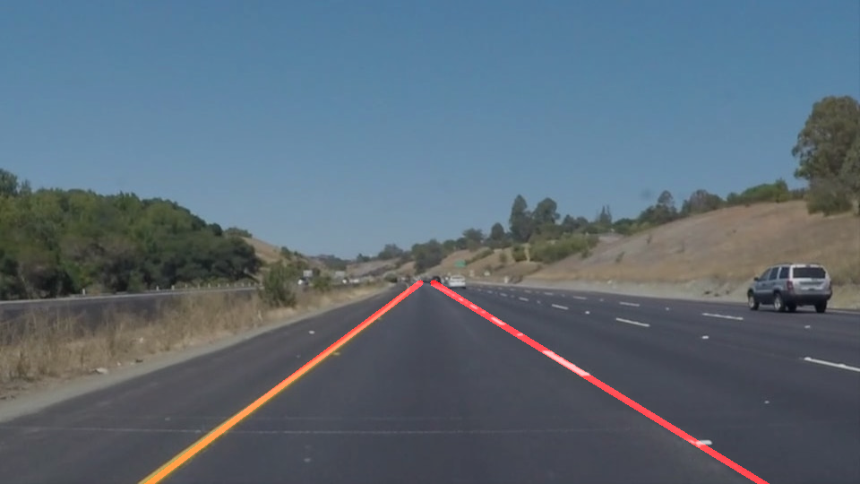

# **Finding Lane Lines on the Road** 

The goals / steps of this project are the following:
* Make a pipeline that finds lane lines on the road
* Reflect on your work in a written report

[image1]: ./examples/grayscale.jpg "Grayscale"

## Reflection

### 1. The Pipeline:

My pipeline consists of 5 steps. First, I converted the images to grayscale, then I applied gauusian smoothening on the image. After this, I extracted edges from the image. On this edge image, I applied a mask to specify a region of interest. From this region of interest, I extracted the lanes using houghman transform. I tuned the parameters of Canny edge and houghman functions to get the best results. 

In order to draw a single line on the left and right lanes, I modified the draw_lines() function by including following logic:
1)Seperate the lines based on the slope. The lines on the left and right lane markings have positive an negative slopes respectively. Calculate average line for the left and right lane.
2)Extrapolate the average lies to top and bottom points(Y = 900 to Y = 315) 
3)In order to prevent occasional occuerences of noisy lines from effecting the lane markings, I filtered out all the lines whose slope is between -0.4 and 0.4.

### 2. Potential shortcomings in the pipeline

1)The output of the optional challenge is not optimal. The identifid lane markings deflect widely in presence of trees and shadows. 
2)The identified lane markings intersect.

### 3. Possible improvements to the pipeline

1)A possible improvement would be to impliment a better pipeline for lane detuction in the turns.
2)Another potential improvement could be to make the pipeline more robust to shadows and other distractions.

